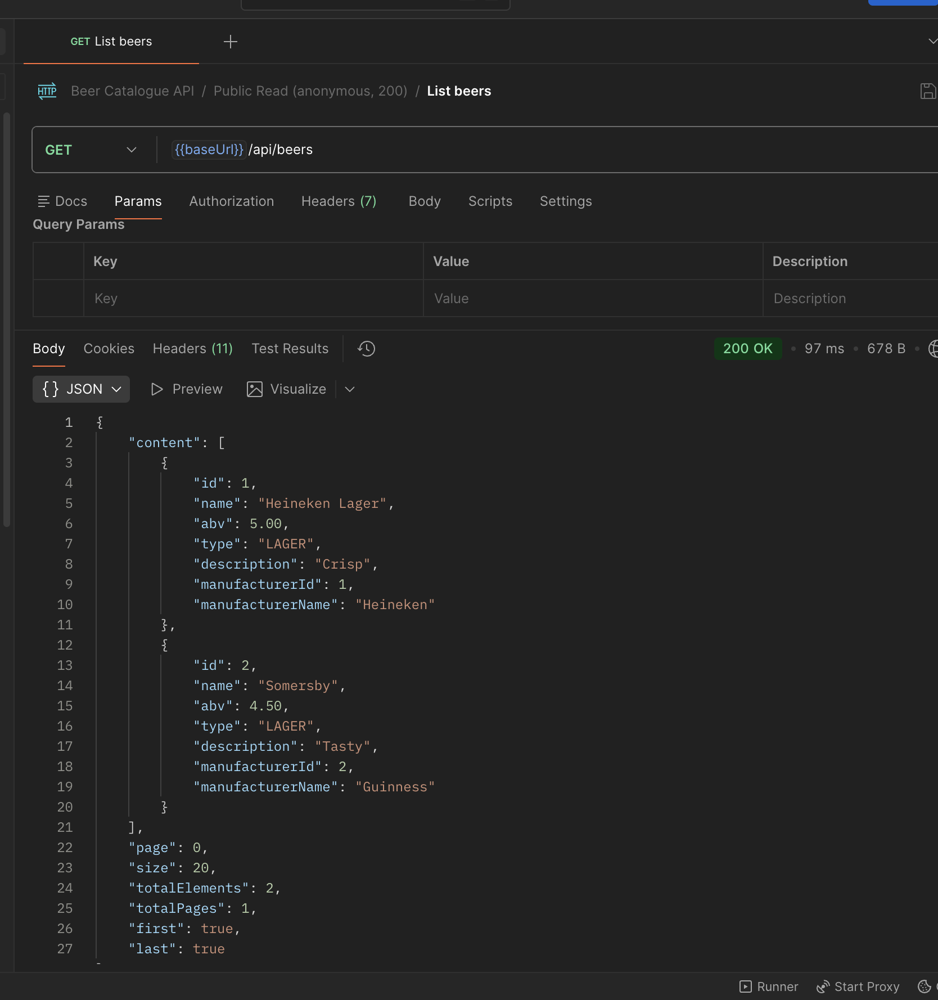
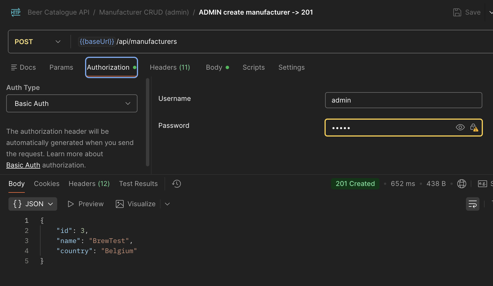
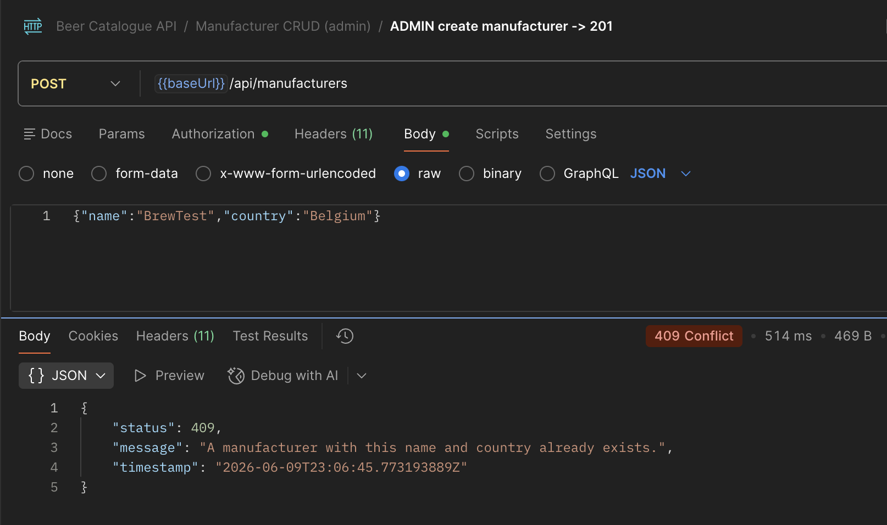
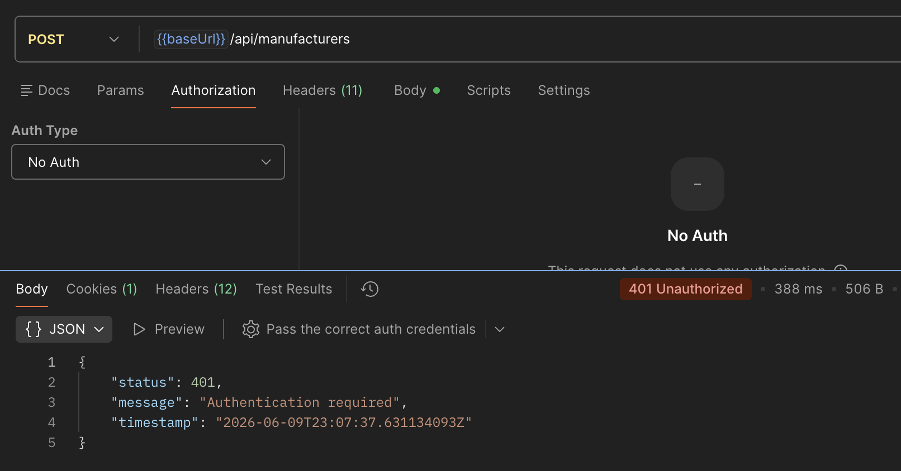
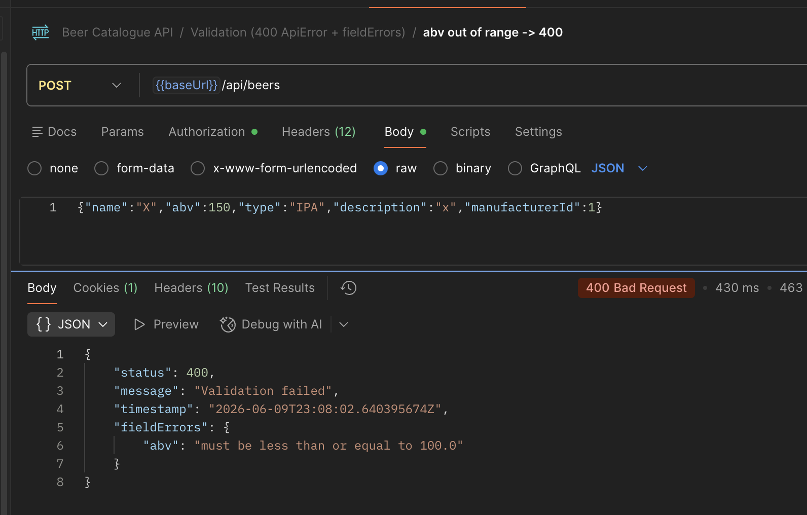
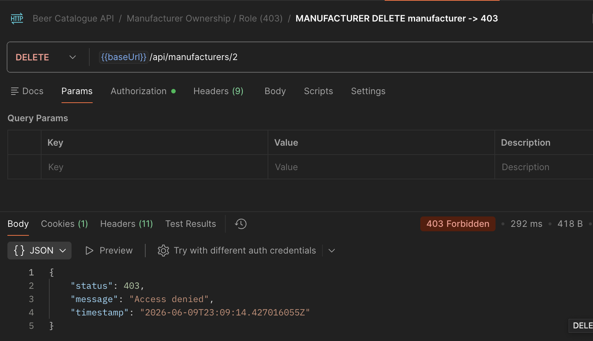
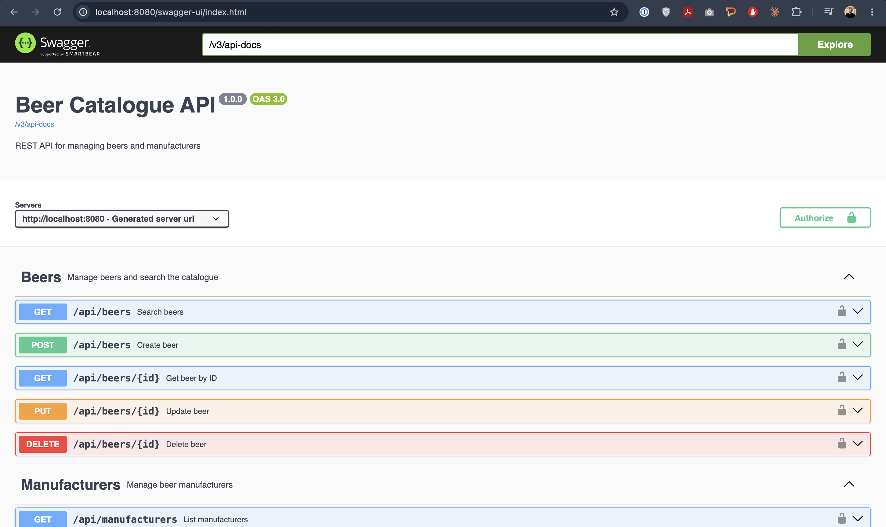

# Beer Catalogue API

A RESTful API for managing a catalogue of beers and their manufacturers, built as a technical
challenge submission. The service exposes full CRUD operations for both
`Manufacturer` and `Beer` resources, enforces role-based access control (anonymous read-only,
manufacturer-scoped writes, and an admin super-user), and supports server-side search and
pagination. The project includes a Terraform + Helm stack for deployment to AWS EKS with an RDS
PostgreSQL backend.

---

## Tech Stack

- **Java 21** / **Spring Boot 3.3.13**
- **Spring Data JPA** + **Hibernate** (validation mode — schema is owned by Liquibase)
- **Spring Security** (HTTP Basic, role-based)
- **PostgreSQL 16** (runtime), **H2** (tests only)
- **Liquibase** (database migrations)
- **springdoc OpenAPI 2.6.0** (Swagger UI)
- **Docker** + **Docker Compose**
- **Terraform** (VPC, EKS, RDS)
- **Helm** (Kubernetes chart)

---

## Quick Start — Local (Docker Compose)

Requires Docker with the Compose plugin.

```bash
docker compose up --build
```

| Resource | URL |
|----------|-----|
| API base | http://localhost:8080/api |
| Swagger UI | http://localhost:8080/swagger-ui/index.html |
| OpenAPI JSON | http://localhost:8080/v3/api-docs |
| Health | http://localhost:8080/actuator/health |

The Compose stack starts a PostgreSQL 16 container and waits for it to be healthy before starting
the application. Demo data (two manufacturers, three users) is seeded automatically on first
startup by `DataSeeder`.

> **Note:** H2 (in PostgreSQL compatibility mode) is used for tests only. The `local` and `prod`
> profiles connect to a real PostgreSQL instance.

---

## Running Tests

```bash
mvn test
```

The test suite includes unit tests (Mockito) and integration tests (Spring Boot + MockMvc + H2).
Integration tests run with `@ActiveProfiles("test")`, which activates the H2 in-memory datasource
and skips `DataSeeder`. All tests assert response body content, not only HTTP status codes.

---

## API Overview

### Manufacturers

| Method | Path | Auth | Description |
|--------|------|------|-------------|
| `GET` | `/api/manufacturers` | None | Search / list (paginated) |
| `GET` | `/api/manufacturers/{id}` | None | Get by ID |
| `POST` | `/api/manufacturers` | ADMIN | Create |
| `PUT` | `/api/manufacturers/{id}` | MANUFACTURER (own) / ADMIN | Update |
| `DELETE` | `/api/manufacturers/{id}` | ADMIN | Delete |

**Search filters:** `name` (substring, case-insensitive), `country` (substring, case-insensitive).

### Beers

| Method | Path | Auth | Description |
|--------|------|------|-------------|
| `GET` | `/api/beers` | None | Search / list (paginated) |
| `GET` | `/api/beers/{id}` | None | Get by ID |
| `POST` | `/api/beers` | MANUFACTURER (own) / ADMIN | Create |
| `PUT` | `/api/beers/{id}` | MANUFACTURER (own) / ADMIN | Update |
| `DELETE` | `/api/beers/{id}` | MANUFACTURER (own) / ADMIN | Delete |

**Search filters:** `name` (substring), `type` (enum: `IPA`, `LAGER`, `STOUT`, `PILSNER`, `ALE`,
`OTHER`), `abv` (exact), `minAbv`, `maxAbv`, `manufacturerName` (substring).

**Pagination / sorting** (all list endpoints):

```
GET /api/beers?page=0&size=10&sort=name,asc
GET /api/beers?type=IPA&minAbv=5.0&maxAbv=8.0&page=0&size=20
```

Default page size is 20, default sort is `name` ascending. See the Swagger UI for the full
request/response schema.

---

## Example Requests

### Anonymous — list beers

```bash
curl http://localhost:8080/api/beers
```

### Admin — create a manufacturer (201 + Location header)

```bash
curl -i -u admin:admin \
  -X POST http://localhost:8080/api/manufacturers \
  -H 'Content-Type: application/json' \
  -d '{"name": "Budweiser", "country": "USA"}'
```

```
HTTP/1.1 201 Created
Location: http://localhost:8080/api/manufacturers/3

{"id":3,"name":"Budweiser","country":"USA"}
```

### Duplicate manufacturer — 409

```bash
curl -i -u admin:admin \
  -X POST http://localhost:8080/api/manufacturers \
  -H 'Content-Type: application/json' \
  -d '{"name": "Heineken", "country": "Netherlands"}'
```

```
HTTP/1.1 409 Conflict

{"status":409,"message":"A manufacturer with this name and country already exists.","timestamp":"..."}
```

### Anonymous write — 401

```bash
curl -i \
  -X POST http://localhost:8080/api/manufacturers \
  -H 'Content-Type: application/json' \
  -d '{"name": "Anon", "country": "Nowhere"}'
```

```
HTTP/1.1 401 Unauthorized

{"status":401,"message":"Authentication required","timestamp":"..."}
```

### Screenshots

| | |
|--|--|
|  |  |
| Paginated public read — `GET /api/beers` | Admin create with 201 + Location header |
|  |  |
| Uniqueness conflict — same name + country rejected | Anonymous write rejected with 401 |
|  |  |
| Field-level validation error with `fieldErrors` map | Ownership enforced — manufacturer can't edit another's resource |


*Generated OpenAPI documentation at `/swagger-ui/index.html`*

---

## Postman Collection

A ready-to-import collection is at `docs/beer-catalogue-api.postman_collection.json`.

**Import:** File → Import → select the JSON file. The collection uses `{{baseUrl}}` (default
`http://localhost:8080`) and pre-configured Basic Auth variables for all three demo users
(`admin/admin`, `heineken/pass`, `guinness/pass`).

**Running the collection:**

1. Run the **"Setup — Seed Test Data"** folder first — it creates sample manufacturers and beers
   and stores their auto-generated IDs in collection variables (`createdManufacturerId`,
   `createdBeerId`), so all subsequent requests work without manual ID editing.
2. Run folders 1–7 in order.
3. Run **"Cleanup"** to delete the created resources.

**"Run collection"** executes status and response-body assertions end to end; all requests should
go green against a freshly started local app.

**Testing against AWS:** set `{{baseUrl}}` to the ELB hostname printed by `deploy.sh`.

---

## Demo Credentials

Seeded at startup by `DataSeeder` on non-test profiles (`@Profile("!test")`). Seeding is
idempotent — it runs only when the user table is empty.

| Username | Password | Role | Scope |
|----------|----------|------|-------|
| `admin` | `admin` | ADMIN | Full access to everything |
| `heineken` | `pass` | MANUFACTURER | Heineken's beers and their own manufacturer |
| `guinness` | `pass` | MANUFACTURER | Guinness's beers and their own manufacturer |

These credentials are for local demonstration only. They are never used in automated tests.

---

## Security Model

| Principal | Read | Create Manufacturer | Update Manufacturer | Delete Manufacturer | Create / Update / Delete Beer |
|-----------|------|---------------------|---------------------|---------------------|-------------------------------|
| Anonymous | ✓ | ✗ | ✗ | ✗ | ✗ |
| MANUFACTURER | ✓ | ✗ | Own only | ✗ | Own manufacturer only |
| ADMIN | ✓ | ✓ | Any | ✓ | Any |

URL-level rules are declared in `SecurityConfig`. Ownership is **additionally** enforced in the
service layer (`OwnershipChecker`) so the access policy holds regardless of how the service is
called — a MANUFACTURER cannot write resources belonging to another manufacturer even if the URL
matcher were ever relaxed.

All error responses share a consistent `ApiError` shape:

```json
{
  "status": 403,
  "message": "Not authorized to update this manufacturer",
  "timestamp": "2026-06-10T10:00:00Z"
}
```

`fieldErrors` is a `{ field: message }` map included **only** on 400 validation errors; it is
absent on all other responses (`@JsonInclude(NON_NULL)`).

---

## Design Decisions

- **Package-by-feature** (`beer`, `manufacturer`, `security`, `common`) rather than
  package-by-layer, keeping related types co-located.

- **Records for DTOs, no Lombok.** Java records give immutable, concise value types with no
  annotation-processor dependency.

- **Liquibase as the single schema source; `ddl-auto=validate`.** Hibernate validates the schema
  on startup but never modifies it; all structural changes go through versioned SQL changesets
  in `src/main/resources/db/changelog/`.

- **H2 (PostgreSQL compatibility mode) for tests.** The same Liquibase changelogs run against H2
  in tests, including the `UNIQUE` constraint, so there is no schema divergence between the test
  and production databases.

- **Search via JPA Specifications.** `BeerSpecification` and `ManufacturerSpecification` compose
  predicates dynamically; `JpaSpecificationExecutor` handles the rest. Pagination is exposed via
  Spring `Pageable` and wrapped in a `PageResponse` record for a stable JSON contract.

- **Manufacturer business-key equality (`name + country`) + a DB unique constraint.** Duplicate
  attempts are caught at the service layer before reaching the database (returning a specific 409
  message); the DB constraint is a safety net. Beer uses identity equality because it has no
  natural business key — this asymmetry is intentional.

- **Ownership enforced in the service layer.** `OwnershipChecker` reads the authenticated
  principal from the `SecurityContext` and compares manufacturer IDs. This is defence-in-depth on
  top of the URL-level role checks.

- **FK cascade behaviour.** Deleting a `Manufacturer` cascades deletes to its `Beer` rows
  (`ON DELETE CASCADE`) and sets `app_user.manufacturer_id` to `NULL` (`ON DELETE SET NULL`),
  preserving user accounts without leaving dangling foreign keys.

- **Consistent `ApiError` across 400 / 401 / 403 / 404 / 409.** `GlobalExceptionHandler` maps
  every exception type to a typed response body; `RestAuthenticationEntryPoint` and
  `RestAccessDeniedHandler` apply the same shape for security-layer rejections.

- **Code-first OpenAPI.** Each controller implements a dedicated `*Api` interface carrying all
  `@Operation` / `@ApiResponse` annotations, keeping the controller class clean and the spec
  complete.

- **No API versioning.** Out of scope for this challenge; a `/api/v1/` prefix or
  `Accept`-header strategy would be the natural next step.

---

## Cloud Deployment (Bonus)

Infrastructure lives under `infra/`:

```
infra/
├── terraform/          # AWS infrastructure
│   ├── versions.tf     # Provider pins (AWS ~>5.0, Kubernetes ~>2.0)
│   ├── variables.tf
│   ├── vpc.tf          # VPC, subnets, NAT gateway
│   ├── eks.tf          # EKS cluster + managed node group (t3.small)
│   ├── rds.tf          # RDS PostgreSQL 16 (db.t3.micro, private subnets)
│   └── outputs.tf      # kubectl config command, JDBC URL, etc.
└── helm/
    └── beer-catalogue/ # Helm chart
        ├── Chart.yaml
        ├── values.yaml          # Defaults / placeholders
        ├── values-aws.yaml      # EKS + RDS overrides
        ├── values-local.yaml    # Docker Desktop Kubernetes
        └── templates/
            ├── deployment.yaml
            ├── service.yaml
            ├── configmap.yaml
            ├── secret.yaml      # DB credentials (injected via --set, never committed)
            └── postgres.yaml    # Optional in-cluster Postgres (local dev only)
```

### Run on Kubernetes locally (Docker Desktop)

This was used to validate the Helm chart before deploying to AWS.

1. Enable Kubernetes in Docker Desktop (**Settings → Kubernetes → Enable Kubernetes**).

2. Build the image locally. On Apple Silicon, **no `--platform` flag** is needed here — the local
   cluster is arm64. The `--platform linux/amd64` flag is only required for x86 EKS nodes, which
   `deploy.sh` handles automatically.

   ```bash
   docker build -t beer-catalogue-api:local .
   ```

3. Install with the local values file (self-contained: in-cluster ephemeral Postgres + NodePort
   service on port 30080):

   ```bash
   helm install beer-catalogue infra/helm/beer-catalogue -f infra/helm/values-local.yaml
   ```

4. Test the API:

   ```bash
   curl http://localhost:30080/api/beers
   ```

5. Remove when done:

   ```bash
   helm uninstall beer-catalogue
   ```

---

### AWS Prerequisites & Setup

Before running the Terraform or Helm commands below:

- **AWS account** and **AWS CLI 2.15+** installed.

  **AWS CLI 2.15+ is required.** The EKS Access Entry commands (`create-access-entry` /
  `associate-access-policy`) were added in CLI 2.15; older versions (e.g. 2.11) fail with
  `"Invalid choice: create-access-entry"`. Check your version:

  ```bash
  aws --version
  ```

  Upgrade via the official installer (Homebrew will **not** upgrade a CLI installed via the `.pkg`
  installer):

  ```bash
  curl "https://awscli.amazonaws.com/AWSCLIV2.pkg" -o AWSCLIV2.pkg && sudo installer -pkg AWSCLIV2.pkg -target /
  ```

- **kubectl 1.28+** and **Helm 3.12+** (modern v3 or v4).
- Configure a dedicated IAM profile. Using a named profile rather than the default keeps
  beer-catalogue credentials isolated from other AWS work.

  ```bash
  aws configure --profile beer-catalogue
  ```

  For an evaluation, `AdministratorAccess` is the simplest policy. Delete the IAM user after the
  evaluation is complete.

- Export the profile for the duration of the session (required for AWS CLI, Terraform, and the
  deploy scripts):

  ```bash
  export AWS_PROFILE=beer-catalogue
  ```

- Verify credentials:

  ```bash
  aws sts get-caller-identity
  ```

  The output should show the IAM user ARN, not a root account.

- The stack deploys to **eu-central-1** by default (configurable via `variables.tf`).

---

### Cost & Teardown Warning

> **This stack incurs real AWS charges.** Estimated cost while running:
> - EKS control plane: ~$0.10 / hr
> - NAT gateway: ~$0.045 / hr
> - Classic ELB (created by the LoadBalancer service): ~$0.0225 / hr
> - t3.small worker nodes: variable
> - RDS db.t3.micro: Free Tier eligible
>
> **Total: roughly $0.20–0.25 / hr, or ~$5–6 / day.**
>
> **Set an AWS Budget alert before deploying.**
>
> **Always run `./infra/scripts/destroy.sh` when finished.** Teardown order matters: the script
> uninstalls the Helm release first to release the ELB, then runs `terraform destroy` to remove
> the VPC. Skipping the Helm uninstall causes a `DependencyViolation` — Terraform cannot delete
> the VPC while the ELB still holds a reference to it, leaving orphaned billable resources.

---

### Provisioning AWS Infrastructure

```bash
./infra/scripts/plan.sh        # read-only preview
./infra/scripts/deploy.sh      # provision VPC + EKS + RDS
```

### Deploying to EKS

`deploy.sh` runs this automatically. The manual form below is only needed when re-deploying an
image to an already-provisioned cluster (i.e. after `deploy.sh` has already run once):

```bash
helm upgrade --install beer-catalogue infra/helm/beer-catalogue \
  -f infra/helm/values-aws.yaml \
  --set image.repository=<ECR_REPO> \
  --set image.tag=<TAG> \
  --set db.host=<RDS_ENDPOINT> \
  --set db.user=beeradmin \
  --set db.password=<SECRET>
```

#### EKS Access Entry (handled automatically by deploy.sh)

`deploy.sh` automatically grants the deploying IAM principal Kubernetes API access via an EKS
access entry. This is necessary because the Terraform config sets
`bootstrap_cluster_creator_admin_permissions = false` — a deliberate security choice that requires
explicit access grants rather than giving implicit admin to whoever ran Terraform. Without it,
`kubectl` and `helm` would fail with `"the server has asked for the client to provide credentials"`.

The script runs `aws eks create-access-entry` and `aws eks associate-access-policy` (attaching
`AmazonEKSClusterAdminPolicy`), then re-runs `update-kubeconfig` and verifies with `kubectl get
nodes` — no manual action needed. See the Troubleshooting section if access still fails after a
`deploy.sh` run.

### Tear-down

```bash
./infra/scripts/destroy.sh
```

### Troubleshooting

| Symptom | Fix |
|---------|-----|
| `"the server has asked for the client to provide credentials"` | The IAM principal has no EKS access entry. Run `aws eks create-access-entry` and `aws eks associate-access-policy` manually (see the EKS Access Entry subsection above), then re-run `aws eks update-kubeconfig`. |
| `"Invalid choice: create-access-entry"` | AWS CLI is older than 2.15. Upgrade via the official `.pkg` installer (see AWS Prerequisites). |
| Helm `"another operation (install/upgrade/rollback) is in progress"` | A previous failed run left a pending-install release. Inspect with `helm list -n default`, then `helm uninstall beer-catalogue -n default` and re-run. |
| Pod stuck in `CrashLoopBackOff` | Check `kubectl logs -l app.kubernetes.io/name=beer-catalogue`; most often a database connectivity or password-mismatch issue. |

### How this satisfies the Helm requirement

The Helm chart parameterises the entire deployment: image, replica count, service type, and
database connection are all driven by values files. The RDS endpoint and port are supplied via
`values-aws.yaml`; credentials are delivered through a Kubernetes `Secret` generated at deploy
time via `--set` and are **never stored in version control**.

### Production notes (next steps)

- DB credentials → **AWS Secrets Manager** with the `external-secrets` operator.
- Terraform state → **S3 backend** with DynamoDB locking.
- Private RDS is reached from EKS pods inside the VPC; external access requires a VPN or bastion.
- EKS API endpoint should be made private with restricted `public_access_cidrs`.

---

## Project Structure

```
beer-catalogue-api/
├── src/
│   ├── main/
│   │   ├── java/com/haufe/beercatalogue/
│   │   │   ├── beer/               # Entity, controller, service, repository, specs, DTOs
│   │   │   ├── manufacturer/       # Entity, controller, service, repository, specs, DTOs
│   │   │   ├── security/           # AppUser, roles, UserDetails, ownership checker, auth handlers
│   │   │   └── common/
│   │   │       ├── config/         # SecurityConfig, OpenApiConfig
│   │   │       ├── dto/            # PageResponse
│   │   │       ├── exception/      # ApiError, GlobalExceptionHandler, NotFoundException, ConflictException
│   │   │       └── seed/           # DataSeeder
│   │   └── resources/
│   │       ├── application.yml
│   │       ├── application-local.yml
│   │       ├── application-prod.yml
│   │       └── db/changelog/       # Liquibase: 001 manufacturer, 002 beer, 003 app_user
│   └── test/
│       └── java/com/haufe/beercatalogue/
│           ├── BeerCatalogueApplicationTests.java
│           ├── beer/               # BeerControllerTest, BeerSearchTest, BeerSecurityTest, BeerServiceTest, BeerTestFactory
│           └── manufacturer/       # ManufacturerControllerTest, ManufacturerSecurityTest, ManufacturerServiceTest, ManufacturerTestFactory
├── docs/
│   ├── beer-catalogue-api.postman_collection.json
│   └── screenshots/
├── infra/
│   ├── terraform/
│   ├── helm/
│   └── scripts/
├── Dockerfile
├── docker-compose.yml
└── pom.xml
```

---

## Trade-offs & Future Improvements

Deliberate decisions made for this challenge, and what would change in a production system:

- **Beer has no `equals`/`hashCode`.** Beer relies on identity equality because it has no natural
  business key — unlike `Manufacturer`, whose `(name, country)` pair is stable and unique. The
  asymmetry is intentional; a surrogate or composite business key could be introduced if `Beer`
  ever needs value-based set semantics.

- **`Manufacturer.delete()` has no ownership check.** This is deliberate: the security matrix
  restricts `DELETE /api/manufacturers/**` to `ADMIN` only, unlike `PUT` which a `MANUFACTURER`
  may call on its own resource. Adding an ownership check to `delete()` would be dead code.

- **Demo credentials are hardcoded in `DataSeeder`.** This is a convenience for evaluators; a
  production system would never seed fixed passwords and would externalise user management to a
  proper identity store (e.g. Keycloak, Cognito).

- **HTTP Basic auth.** Chosen for simplicity per the challenge scope. Production would use
  OAuth2/OIDC with JWT tokens and a dedicated identity provider; HTTP Basic over TLS is acceptable
  for internal tooling but not for user-facing APIs.

- **No API versioning.** A `/api/v1/` path prefix or `Accept`-header versioning strategy would be
  the natural next step before any consumers build against this API.

- **Kubernetes `Secret` holds DB credentials as base64.** Base64 is encoding, not encryption;
  anyone with `kubectl get secret` access can read the value. Production would use AWS Secrets
  Manager via the `external-secrets` operator and enable etcd encryption at rest with KMS.

- **Terraform state is local.** The `.terraform` directory lives on the developer's machine. A
  team setup would use an S3 backend with DynamoDB state locking to prevent concurrent applies.

- **EKS API endpoint is public.** This was chosen for evaluation convenience. Production would
  make the endpoint private, restrict `public_access_cidrs`, and access the cluster via VPN or
  a bastion.

- **`update()` always saves, even when the key is unchanged.** There is no early-return path
  after `applyTo()` — the `save()` call is unconditional by design, so a future `lastModifiedAt`
  field populated by JPA Auditing would always be refreshed, regardless of whether any field
  actually changed.

- **Possible enhancements for production:** idempotency keys on write endpoints, optimistic
  locking (`@Version`) to prevent lost updates under concurrency, rate limiting, structured
  request logging and distributed tracing, consumer contract tests (Pact), and a CI/CD pipeline
  (GitHub Actions → ECR → `helm upgrade`).

---

## AI Usage Disclosure

AI assistance (Claude, an LLM coding assistant by Anthropic) was used during the development of
this project. Specifically, it helped with generating boilerplate (entity/DTO/controller
scaffolding, test fixtures), discussing design trade-offs (ownership model, conflict-handling
strategy, schema cascade behaviour), reviewing code for consistency and completeness, and
producing initial scaffolding for the Terraform modules and Helm chart. All generated code was
read, understood, tested, and validated by the author before being committed; the design decisions
and their rationale are the author's own.
